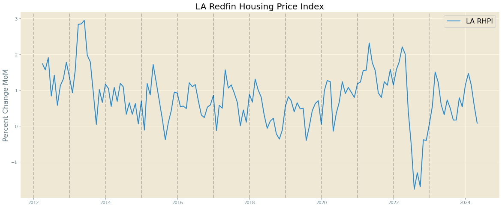

# Forecasting Redfin's Housing Price Index In Los Angeles

### Background

In 2023, Redfin released their Housing Price Index, which uses the repeat sales pricing method to measure changes in U.S home prices. More information about the index can be found at - https://www.redfin.com/news/redfin-home-price-index/. They release their index monthly, with about a 1 month lag. In this project, I use various time series forecasting methods to forecast their index into the future, allowing interested parties such as real estate professionals, buyers, sellers, and financial institutions to look ahead at what is coming in the housing market. 

I decided to perform this analysis only on the Los Angeles Area to keep my analysis more focused. 

### Methods and Data

To forecast this time series, I tried using both arima methods and vector autoregression methods. Ultimately, the vector autoregression results gave the better forecasts. 

Input features to the vector autoregression included: 

* Median List Price MoM
* Median Price Per Sqaure Foot MoM
* Median List Pripce Per Sqaure Foot MoM
* Sold above List MoM
* Avg Sale to List MoM
* Mortgage Rate (National 30 yr fixed) 
* Unemployment Rate in Los Angeles

### Results

Here is a more zoomed in look:

Model Performance:

MAE on Test Set = 0.548

### Next Steps

* Formalize evaluation scripts
* Display Results in Tableau Dashboard
* Use Github Actions to create CI/CD pipeline to automatically retrain model and publish new model 